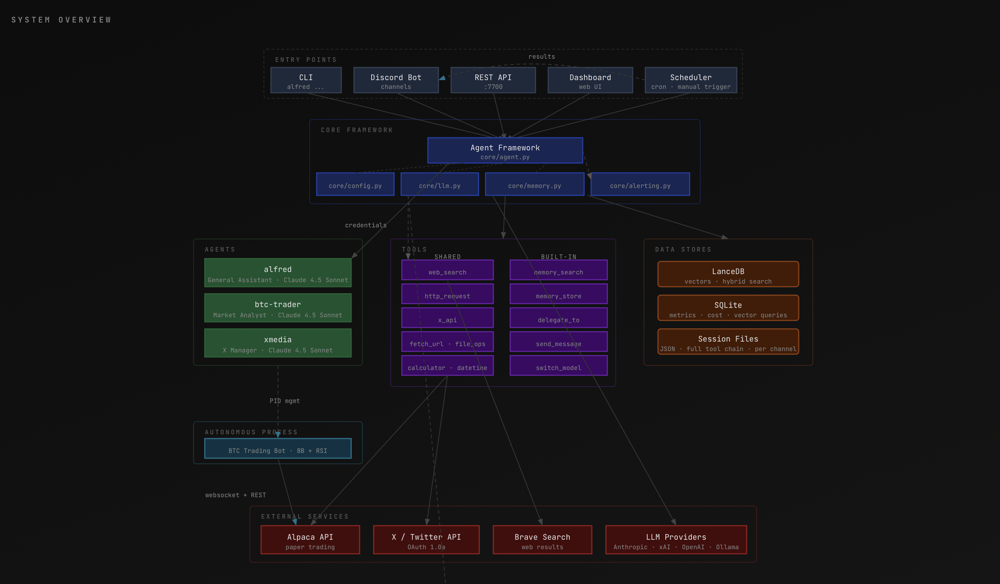
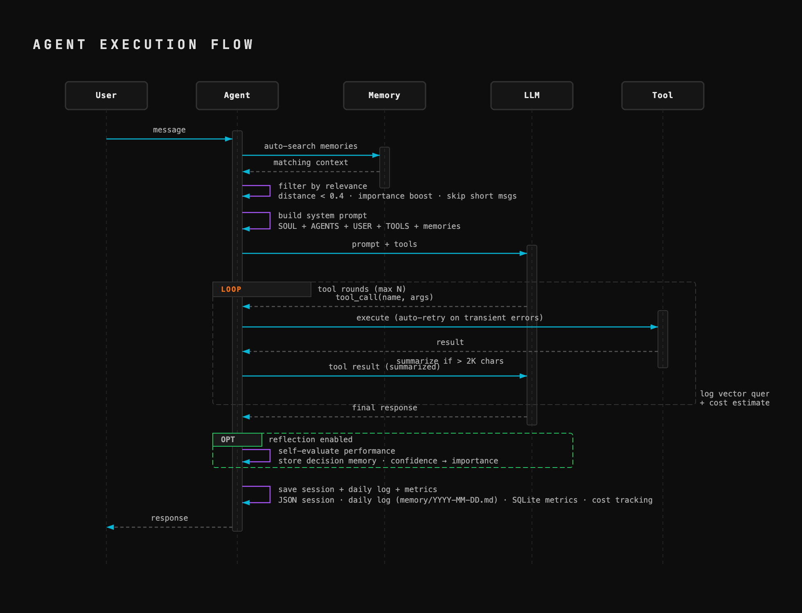

# Alfred AI


A memory-first agent framework in Python. Create AI agents that remember, learn, and act — with built-in Discord integration, cost tracking, and autonomous process management.

## What is Alfred?

Alfred is a lightweight framework for building persistent AI agents. Each agent has:

- **Vector memory** — automatic context recall powered by LanceDB + hybrid search, importance scoring, temporal decay, deduplication, and weekly compaction
- **Self-learning** — optional post-session reflection loop with confidence scoring, decision-to-outcome linking, and importance-weighted recall
- **Tools** — builtin, shared, and per-agent toolkits with auto-discovery, auto-retry, circuit breaker, and a full CLI for creating, installing, and managing tools
- **A workspace** — persistent files that define the agent's identity, knowledge, and state
- **Multi-provider LLM support** — Anthropic, xAI, OpenAI, and Ollama (local) with automatic fallback
- **Multi-agent delegation** — agents can delegate tasks and message each other
- **Session persistence** — conversation history survives restarts with full tool chain preservation
- **Cost tracking** — per-model USD cost estimates, per-agent daily budgets, and dashboard cost views
- **Alerting** — Discord + generic webhook alerts for error spikes, cost thresholds, schedule failures, and crashes
- **Secret sanitization** — automatic redaction of API keys and tokens in agent responses
- **HTTP API** — REST endpoints for integration with scripts, apps, and UIs
- **Discord integration** — map agents to Discord channels with one command
- **Autonomous processes** — manage long-running bot processes (e.g., BTC trading bot) with PID lifecycle management
- **Migration** — export, import, and migrate your entire setup between directories or machines

## Quick Start

**One-line install** (clones, installs dependencies, symlinks):
```bash
curl -sL https://raw.githubusercontent.com/Aaron-A/Alfred-Ai/main/install.sh | bash
```

Then run the setup wizard:
```bash
alfred setup                     # Configure LLM + create first agent
alfred discord setup             # Connect to Discord
alfred start                     # Start Alfred
```

<details>
<summary>Manual install</summary>

```bash
git clone https://github.com/Aaron-A/Alfred-Ai.git
cd Alfred-Ai
uv sync                          # Creates venv + installs all dependencies
uv sync --extra trading          # Include trading bot dependencies (optional)
sudo ln -sf "$(pwd)/alfred" /usr/local/bin/alfred
alfred setup
```

> **Don't have uv?** Install it with `curl -LsSf https://astral.sh/uv/install.sh | sh`
> or see [docs.astral.sh/uv](https://docs.astral.sh/uv/getting-started/installation/).
>
> **Prefer not to symlink?** Use `uv run alfred` instead of `alfred` for all commands.

</details>

The setup wizard walks you through:
1. Configuring your LLM provider and API key
2. Selecting a model
3. Initializing the embedding model for memory
4. Creating your first agent (Alfred, by default)

Then `alfred discord setup` auto-discovers your server and channels, and `alfred start` launches everything as a background daemon.

## CLI Reference

<details>
<summary>Click to expand full command list</summary>

```
alfred setup                    Interactive setup wizard
alfred start                    Start all services (API + scheduler + Discord)
alfred start --fg               Start in foreground (Ctrl+C to stop)
alfred start --port 8080        Start with API on custom port
alfred stop                     Stop all services
alfred restart                  Stop + start in one command
alfred status                   Show configuration and running state
alfred logs                     Tail the log file

alfred provider add             Add an LLM provider
alfred models update            Fetch latest models from provider APIs
alfred models list              Show available models

alfred agent create             Create a new agent
alfred agent list               List all agents
alfred agent info               Show agent details
alfred agent chat               Interactive chat with an agent
alfred agent pause / resume     Pause or resume an agent
alfred agent delete             Delete an agent

alfred agent schedule add       Add a scheduled task (with optional retry config)
alfred agent schedule list      List scheduled tasks (shows stats + next run)
alfred agent schedule remove    Remove a scheduled task
alfred agent schedule enable    Resume a paused schedule
alfred agent schedule disable   Pause a schedule without removing it
alfred agent schedule run       Manually trigger a schedule right now
alfred agent schedule history   Show run history with success/fail stats
alfred agent schedule retry     Configure retry settings (max retries, delay)

alfred session list [agent]     List all saved conversation sessions
alfred session view <a> <id>    View a session's conversation history
alfred session export <a> <id>  Export session to markdown or text
alfred session delete <a> <id>  Delete a saved session

alfred tools list               List all available tools
alfred tools list <agent>       List tools for a specific agent

alfred tool info <name>         Show tool details and source
alfred tool install <url>       Install a community tool from URL
alfred tool create <name>       Scaffold a new tool in agent workspace
alfred tool search <query>      Search tool registry
alfred tool remove <name>       Remove a workspace tool

alfred service add              Add external service credentials
alfred service list             List configured services
alfred service remove           Remove a service

alfred discord setup            Configure Discord bot (token, channels, agents)
alfred discord status           Show Discord channel mappings

alfred api start               Start API only — dev mode (port 7700)
alfred api start --port 8080   Start on custom port

alfred migrate <path>          Move Alfred to a new directory
alfred export [file]           Export config + data for migration
alfred import <file>           Import config + data into this install
```

</details>

## Web Dashboard

Start Alfred and open `http://localhost:7700` in your browser:

```bash
alfred start           # API + scheduler + Discord (daemon)
alfred start --fg      # same, but foreground
```

Or API-only for development:

```bash
alfred api start       # API only, no scheduler/Discord
```

The dashboard shows:
- **Stats grid** — agent count, total messages, token usage, estimated cost, avg response time, Discord health
- **Agents tab** — all agents with status, provider/model (editable via modal), sessions, messages, tokens, cost, errors
- **+ New Agent** — create agents directly from the dashboard with optional LLM-generated SOUL.md
- **Schedules tab** — all scheduled tasks with run stats, success rates, next fire time, manual trigger
- **Metrics tab** — per-model cost breakdown, per-agent detail cards, and vector query logs with relevance scores
- **Trading tab** — multi-agent view (BTC, TSLA, etc.) with live charts, account equity, positions, bot status, recent trades with P&L and IBKR commission tracking

Auto-refreshes every 10 seconds.

## Architecture

Five entry points (CLI, Discord, REST API, Web Dashboard, Scheduler) feed into the Agent Framework. Each agent has its own workspace, tools, memory, and LLM provider. Tools auto-discover credentials from config. Memory is vector-searched on every interaction with smart relevance gating. The alerting system monitors error rates, costs, and crashes via Discord webhooks.



**Agent execution flow:**



> **Interactive diagram:** Start Alfred and visit [`localhost:7700/architecture`](http://localhost:7700/architecture) for the full visual version with clickable nodes and detail panels.

### Project Structure

```
alfred-ai/
  pyproject.toml      Project config + dependencies (uv sync)
  uv.lock             Locked dependency versions
  alfred              CLI launcher (bash wrapper)
  __main__.py         CLI entry point — all commands route through here
  core/
    agent.py          Agent loop: recall → think → act → reflect → learn
    alerting.py       Discord + generic webhook alerts (errors, cost, schedule failures, crashes)
    api.py            FastAPI + trading proxy + agent CRUD + vector queries
    config.py         Config loading/saving (alfred.json)
    discord.py        Bot + daemon + proactive posting
    embeddings.py     Embedding model + LRU cache (256 entries)
    llm.py            Multi-provider LLM client (Anthropic, xAI, etc.)
    logging.py        Structured logging + agent metrics
    memory.py         Vector memory + importance scoring + compaction
    metrics_store.py  SQLite metrics + cost tracking + vector query logging
    models.py         Model registry and provider catalogs
    process.py        Shared PID/kill utilities
    scheduler.py      Cron engine + auto-disable + session/metrics cleanup
    tool_discovery.py Auto-discovery of shared tools
    tool_meta.py      Meta-tools: list, search, create, install, remove
    templates.py      Agent templates for rapid creation (trader, social, research, etc.)
    tools.py          Tool registry + memory_update/link
    workspace.py      Workspace creation and management
  cli/
    setup.py          Interactive setup wizard
  models/
    base.py           Base model definitions
    trade.py          Trading model definitions
    social.py         Social model definitions
  tools/
    web_search.py     Web search (Brave > xAI > DuckDuckGo)
    fetch_url.py      Fetch and read web pages as text
    http_request.py   HTTP client for API calls (GET/POST/PUT/DELETE)
    x_api.py          X/Twitter API (OAuth 1.0a)
    datetime_info.py  Current date/time, timezone conversions, date math
    calculator.py     Safe math expression evaluator
    file_ops.py       Read/write/list files in agent workspace
  static/
    dashboard.html      Web dashboard
    architecture.html   Interactive architecture diagrams
    css/
      dashboard.css     Dark theme styles
    js/
      dashboard.js      API fetching, rendering, modals, auto-refresh
  images/
    alfredarch.png      System architecture diagram
    agentflow.png       Agent execution flow diagram
```

### Key Concepts

**Agents** are the core unit. Each agent has its own workspace directory containing:
- `SOUL.md` — identity, personality, system prompt
- `USER.md` — what the agent knows about its user
- `AGENTS.md` — awareness of other agents
- `TOOLS.md` — tool documentation and usage notes

**Memory** is automatic and isolated per agent. When an agent receives a message, it searches its own vector store for relevant past context and injects it into the prompt. Hybrid search combines vector similarity (0.7 weight) with text matching (0.3 weight). Agents with `memory_shared: true` also get a `memory_search_global` tool to search across all agents. Memory features that keep the system sharp:

- **Importance scoring** — every memory record carries a 0.0-1.0 importance score. Search results get a ±20% distance boost based on importance, so high-value memories surface more readily.
- **Smart auto-recall** — relevance gating filters out low-quality matches (distance > 0.4) and skips recall for very short messages. Prevents noise injection into the system prompt.
- **Temporal decay** — recent memories get a recency bonus during search. A 30-day exponential half-life blends 80% semantic similarity with 20% recency.
- **Deduplication** — before storing a new memory, a similarity check runs against existing records. Near-identical memories (≥ 95% similar) within 24 hours update the existing record instead.
- **Pre-compaction flush** — when the session window fills up and old messages are trimmed, the agent summarizes the expiring context and stores it in vector memory.
- **Weekly compaction** — a maintenance job prunes old low-importance records to keep the vector store lean.
- **Memory quotas** — auto-compaction triggers when an agent exceeds 10K memories, keeping the vector store performant.
- **Outcome linking** — `memory_link` connects decision memories to their trade/action outcomes, enabling causal learning.
- **Embedding cache** — a 256-entry LRU cache (SHA-256 keyed) avoids redundant embedding computations.

**Self-learning** is opt-in per agent via `reflection_enabled: true`. After each session, the agent evaluates its own performance, scores its confidence, and stores the assessment as a decision memory. Confidence maps to importance scoring, so lessons from high-confidence sessions rank higher in future recall.

**Tools** use a layered discovery system:
1. **Builtin** — memory read/write/update/link, delegation, messaging, model switching
2. **Shared** — in the `tools/` directory, available to all agents:
   - `web_search` — search the web (Brave > xAI > DuckDuckGo)
   - `fetch_url` — read web pages as plain text
   - `http_request` — make API calls (GET/POST/PUT/DELETE with headers and body)
   - `x_api` — X/Twitter API integration (OAuth 1.0a)
   - `datetime_info` / `date_diff` — current time, timezone conversions, date math
   - `calculator` — safe math evaluator (arithmetic, trig, log, etc.)
   - `file_read` / `file_write` / `file_list` — read/write files in agent workspace
3. **Workspace** — in an agent's `workspace/tools/` directory, private to that agent
4. **Meta-tools** — agents can create, edit, and manage their own tools at runtime

Tool execution includes **auto-retry** on transient errors (timeout, 429, 503) with exponential backoff, **result summarization** that compresses large tool outputs (> 2K chars) via a lightweight LLM call before feeding them back to the agent, and a **circuit breaker** that auto-skips tools after 3 consecutive failures (resets on first success). Each tool call is timed and logged for observability.

**Multi-agent delegation** lets agents hand tasks to each other. `delegate_to` runs a task synchronously on another agent and returns the result (with a configurable timeout, default 5 minutes, to prevent hung delegations). `send_message` queues async messages to another agent's inbox with delivery confirmation and unique message IDs. Agents see unread inbox notifications in their system prompt.

**Session persistence** saves conversation history to disk after every interaction, including full tool_use and tool_result blocks (preventing tool-call hallucination). On restart, agents resume where they left off. A sliding window keeps the last 50 turns (configurable), trimming oldest messages first — with pre-compaction flush preserving important context before anything is dropped. **Secret sanitization** automatically redacts API keys and tokens (sk-, xai-, ghp_, AKIA, etc.) from agent responses before they're returned or stored.

**Cost tracking** estimates USD cost per interaction based on per-model token pricing (with prefix-based fallbacks for unknown model variants). Costs are logged to SQLite and displayed on the dashboard by agent, by model, and as a running total. Daily cost alerts fire via webhook when thresholds are exceeded. Per-agent daily cost budgets (`max_daily_cost`) can cap spending — the agent refuses to run once the budget is hit.

**Alerting** monitors operational health via Discord webhooks and optional generic HTTP webhooks (`alerts.webhook_url`). Four alert types: error rate spikes (configurable threshold + time window), daily cost exceeding budget, bot crashes (immediate, no cooldown), and schedule failure alerts (when auto-disabled). Alerts are dispatched to all configured endpoints in parallel. Each alert type has its own cooldown to prevent spam.

**Scheduling** uses cron expressions to run agent tasks on a timer. Each schedule tracks full run history with success/fail stats, elapsed time, and consecutive failure count. Failed tasks auto-retry with configurable `max_retries` and `retry_delay_seconds`. Schedules auto-disable after 5 consecutive failures with an alert notification. Reflection is automatically enabled for all scheduled runs. The scheduler also runs weekly maintenance jobs: memory compaction, session cleanup (files older than 30 days), and metrics pruning (events older than 90 days). Missed runs are caught up on startup within a 1-hour window.

**Streaming** is supported across all providers. The API offers an SSE endpoint (`/v1/chat/stream`) for real-time token streaming. Discord supports optional progressive message editing.

**Discord integration** maps channels to agents. Each channel gets its own agent instance for thread safety. Scheduled task results are automatically posted to the agent's Discord channel. Configure with `alfred discord setup`, then `alfred start` launches the bot automatically.

**Autonomous processes** like the BTC trading bot are managed via PID lifecycle. The bot auto-starts when Alfred starts, auto-stops (with graceful position exit) when Alfred stops, and has a morning health check schedule as a safety net.

## Configuration

All configuration lives in `alfred.json` (auto-generated by `alfred setup`):

```json
{
  "llm": {
    "provider": "anthropic",
    "model": "claude-sonnet-4-6"
  },
  "providers": {
    "anthropic": {
      "api_key": "sk-ant-...",
      "model": "claude-sonnet-4-6"
    }
  },
  "agents": {
    "alfred": {
      "workspace": "workspaces/alfred",
      "description": "General-purpose assistant",
      "status": "active",
      "reflection_enabled": false,
      "summarize_tool_results": false,
      "max_tool_rounds": 10
    }
  },
  "alerts": {
    "discord_webhook": "https://discord.com/api/webhooks/...",
    "webhook_url": "https://your-custom-endpoint.com/alerts",
    "rules": {
      "error_rate": { "threshold": 5, "window_minutes": 15, "cooldown_minutes": 30 },
      "daily_cost": { "threshold_usd": 10.0, "cooldown_minutes": 60 },
      "bot_crash": { "cooldown_minutes": 0 }
    }
  },
  "discord": {
    "bot_token": "...",
    "guild_id": "...",
    "channels": {
      "CHANNEL_ID": {
        "name": "general",
        "agent": "alfred",
        "require_mention": false
      }
    }
  }
}
```

> `alfred.json` contains API keys and tokens — it's excluded from git by default.

### Per-Agent Config Options

| Key | Default | Description |
|-----|---------|-------------|
| `max_tool_rounds` | 10 | Max tool call iterations per run |
| `reflection_enabled` | false | Post-session self-evaluation |
| `summarize_tool_results` | false | Compress large tool outputs |
| `tool_result_max_chars` | 2000 | Summarization threshold |
| `auto_recall_threshold` | 0.4 | Memory relevance distance cutoff |
| `memory_shared` | false | Cross-agent memory visibility |
| `max_daily_cost` | 0 (unlimited) | Daily USD cost budget — agent refuses to run if exceeded |
| `delegation_timeout` | 300 | Max seconds to wait for a delegated task |
| `temperature` | 0.7 | LLM sampling temperature |

## Discord Setup

1. Create a bot at [discord.com/developers](https://discord.com/developers/applications)
2. Enable the **Message Content** intent
3. Invite the bot to your server with message read/write permissions
4. Run `alfred discord setup` — it auto-discovers your server and channels
5. Map each channel to an agent
6. Run `alfred start`

Alfred runs as a background daemon. Use `alfred stop` to shut down, `alfred logs` to watch output, and `alfred status` to check what's running. Add `--fg` to `alfred start` for foreground mode.

## HTTP API

Start the REST API server:

```bash
alfred api start              # Default port 7700
alfred api start --port 8080  # Custom port
```

Interactive docs at `http://localhost:7700/docs`. Key endpoints:

```
POST /v1/chat              Send a message to an agent (returns full response)
POST /v1/chat/stream       Stream a response via SSE (Server-Sent Events)
POST /v1/webhook/{agent}   Send an external event to an agent
POST /v1/memory/search     Search vector memory
POST /v1/memory/store      Store a new memory
GET  /v1/agents            List all agents
POST /v1/agents            Create a new agent (with optional SOUL.md generation)
DELETE /v1/agents/{name}   Delete an agent and its workspace
GET  /v1/agents/{name}     Agent details + session info
PATCH /v1/agents/{name}/config  Update agent provider/model
GET  /v1/sessions/{agent}  List saved sessions for an agent
GET  /v1/sessions/{agent}/{id}  Get session messages (?last=N for recent)
DELETE /v1/sessions/{agent}/{id}  Delete a session
GET  /v1/sessions/{agent}/{id}/export  Export as markdown/text
GET  /v1/metrics           Agent activity metrics (with cost data)
GET  /v1/vector-queries    Vector memory query logs
GET  /v1/schedules         All scheduled tasks
POST /v1/schedules/{id}/run  Manually trigger a schedule
GET  /v1/trading/status    Trading bot status + Alpaca account info
GET  /v1/status            System status
GET  /v1/providers         Provider/model registry for UI dropdowns
POST /v1/admin/reload      Restart the daemon to pick up config changes
GET  /health               Health check
```

Example:

```bash
# Standard chat
curl -X POST http://localhost:7700/v1/chat \
  -H "Content-Type: application/json" \
  -d '{"agent": "alfred", "message": "What do you know about me?"}'

# Streaming (SSE)
curl -N http://localhost:7700/v1/chat/stream \
  -H "Content-Type: application/json" \
  -d '{"agent": "alfred", "message": "Tell me a story"}'

# Webhook (external event trigger)
curl -X POST http://localhost:7700/v1/webhook/trader \
  -H "Content-Type: application/json" \
  -d '{"event": "price_alert", "message": "TSLA dropped 5%", "data": {"symbol": "TSLA"}}'

# Create a new agent with LLM-generated personality
curl -X POST http://localhost:7700/v1/agents \
  -H "Content-Type: application/json" \
  -d '{"name": "analyst", "description": "Data analyst", "provider": "anthropic", "model": "claude-sonnet-4-6", "soul_prompt": "A meticulous data analyst who loves spreadsheets and hates ambiguity"}'

# Change an agent's model
curl -X PATCH http://localhost:7700/v1/agents/alfred/config \
  -H "Content-Type: application/json" \
  -d '{"provider": "anthropic", "model": "claude-sonnet-4-6"}'

# View metrics with cost data
curl http://localhost:7700/v1/metrics?period=day

# View vector query logs
curl http://localhost:7700/v1/vector-queries?period=day&limit=50
```

## Web Search

Agents can search the web using the `web_search` tool. Provider priority:

1. **Brave Search API** — real web results, free tier (2,000 queries/month)
2. **xAI Grok** — LLM with web search (fallback)
3. **DuckDuckGo** — instant answer API, no key needed (limited)

To enable Brave Search:

```bash
alfred provider add brave
```

Or set the `BRAVE_API_KEY` environment variable. Get a free key at [brave.com/search/api](https://brave.com/search/api/).

## Local Models (Ollama)

Alfred auto-detects [Ollama](https://ollama.com) during setup. No API key needed — just have Ollama running:

```bash
# Install Ollama (https://ollama.com)
ollama serve
ollama pull llama3.1

# Alfred detects it automatically
alfred setup                    # Auto-detects running instance + models
alfred provider add ollama      # Or add manually later
alfred models update ollama     # Refresh available models
alfred status                   # Shows Ollama status + model count
```

Any agent can use a local model — set the provider per-agent in `alfred.json`:

```json
"agents": {
  "my-agent": {
    "provider": "ollama",
    "model": "llama3.1"
  }
}
```

Ollama runs on `localhost:11434` using OpenAI-compatible APIs. Supported models include Llama, DeepSeek, Qwen, Mistral, Gemma, and anything Ollama supports.

## Roadmap

- **Backtesting engine** — replay historical bars through strategy logic to validate before going live
- **Agent performance analytics** — win rate trends, drawdown curves, and Sharpe ratio tracking on the dashboard
- **Mobile-responsive dashboard** — proper responsive layout for phone and tablet monitoring

## Requirements

- macOS or Linux (Windows via WSL)
- Python 3.10+
- [uv](https://docs.astral.sh/uv/) (recommended) or pip
- An API key from a supported LLM provider (Anthropic, xAI, OpenAI)
- (Optional) [Ollama](https://ollama.com) for local model support
- (Optional) Brave Search API key for web search

## Acknowledgments

Built with the help of:

- [Claude](https://claude.ai) by Anthropic — AI pair-programming and agent intelligence
- [Grok](https://x.ai) by xAI — LLM provider with built-in web search
- [LanceDB](https://lancedb.com) — embedded vector database powering agent memory
- [Sentence Transformers](https://sbert.net) — local embedding models for semantic search
- [FastAPI](https://fastapi.tiangolo.com) — async web framework for the REST API and dashboard
- [Alpaca](https://alpaca.markets) — commission-free trading API for paper and live trading
- [Ollama](https://ollama.com) — local LLM inference
- [Discord.py](https://discordpy.readthedocs.io) — Discord bot framework
- [Brave Search](https://brave.com/search/api/) — web search API
- [uv](https://docs.astral.sh/uv/) — fast Python package manager by Astral

## License

[MIT](LICENSE)
