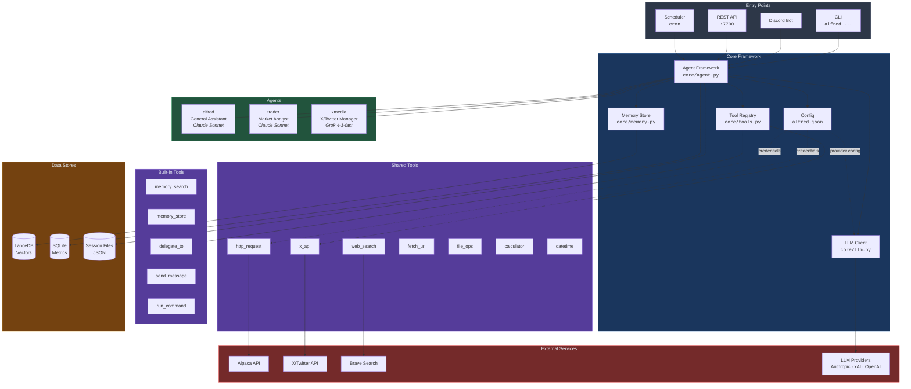
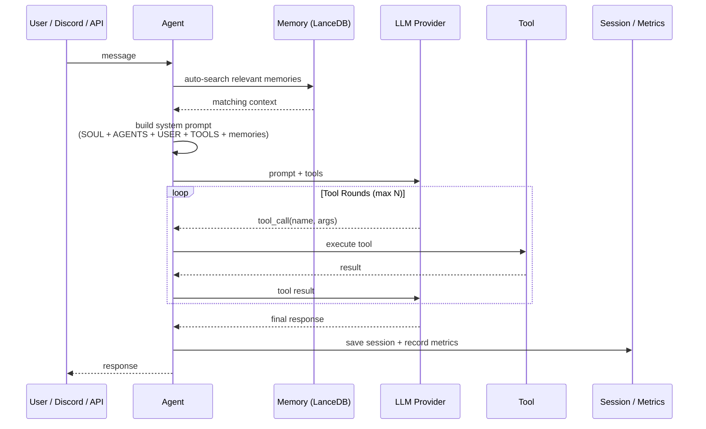

# Alfred AI

A memory-first agent framework in Python. Create AI agents that remember, learn, and act — with built-in Discord integration.

## What is Alfred?

Alfred is a lightweight framework for building persistent AI agents. Each agent has:

- **Vector memory** — automatic context recall powered by LanceDB + hybrid search
- **Tools** — builtin, shared, and per-agent toolkits with auto-discovery
- **A workspace** — persistent files that define the agent's identity, knowledge, and state
- **Multi-provider LLM support** — Anthropic, xAI, and more with automatic fallback
- **Multi-agent delegation** — agents can delegate tasks and message each other
- **Session persistence** — conversation history survives restarts
- **HTTP API** — REST endpoints for integration with scripts, apps, and UIs
- **Discord integration** — map agents to Discord channels with one command

## Quick Start

```bash
# Clone and set up
git clone https://github.com/Aaron-A/Alfred-Ai.git
cd Alfred-Ai
python3 -m venv venv
source venv/bin/activate
pip install anthropic lancedb sentence-transformers discord.py rich fastapi uvicorn

# Symlink the CLI (optional, for global access)
sudo ln -sf "$(pwd)/alfred" /usr/local/bin/alfred

# Run the setup wizard
alfred setup

# Connect to Discord
alfred discord setup

# Start Alfred
alfred start
```

The setup wizard walks you through:
1. Configuring your LLM provider and API key
2. Selecting a model
3. Initializing the embedding model for memory
4. Creating your first agent (Alfred, by default)

Then `alfred discord setup` auto-discovers your server and channels, and `alfred start` launches everything as a background daemon.

## CLI Reference

```
alfred setup                    Interactive setup wizard
alfred start                    Start all services (API + scheduler + Discord)
alfred start --fg               Start in foreground (Ctrl+C to stop)
alfred start --port 8080        Start with API on custom port
alfred stop                     Stop all services
alfred status                   Show configuration and running state
alfred logs                     Tail the log file

alfred provider add             Add an LLM provider
alfred models update            Fetch latest models from provider APIs
alfred models list              Show available models

alfred agent create             Create a new agent
alfred agent list               List all agents
alfred agent info               Show agent details
alfred agent chat               Interactive chat with an agent
alfred agent pause / resume     Pause or resume an agent
alfred agent delete             Delete an agent

alfred agent schedule add       Add a scheduled task (with optional retry config)
alfred agent schedule list      List scheduled tasks (shows stats + next run)
alfred agent schedule remove    Remove a scheduled task
alfred agent schedule enable    Resume a paused schedule
alfred agent schedule disable   Pause a schedule without removing it
alfred agent schedule run       Manually trigger a schedule right now
alfred agent schedule history   Show run history with success/fail stats
alfred agent schedule retry     Configure retry settings (max retries, delay)

alfred session list [agent]     List all saved conversation sessions
alfred session view <a> <id>    View a session's conversation history
alfred session export <a> <id>  Export session to markdown or text
alfred session delete <a> <id>  Delete a saved session

alfred tools list               List all available tools
alfred tools list <agent>       List tools for a specific agent

alfred discord setup            Configure Discord bot (token, channels, agents)
alfred discord status           Show Discord channel mappings

alfred api start               Start API only — dev mode (port 7700)
alfred api start --port 8080   Start on custom port
```

## Web Dashboard

Start Alfred and open `http://localhost:7700` in your browser:

```bash
alfred start           # API + scheduler + Discord (daemon)
alfred start --fg      # same, but foreground
```

Or API-only for development:

```bash
alfred api start       # API only, no scheduler/Discord
```

The dashboard shows:
- **Stats grid** — agent count, total messages, token usage, avg response time, Discord health
- **Agents tab** — all agents with status, provider/model, session count, metrics
- **Schedules tab** — all scheduled tasks with run stats, success rates, next fire time
- **Metrics tab** — per-agent cards with detailed breakdowns and recent errors

Auto-refreshes every 10 seconds. Uses the WatchTower dark theme.

## Architecture

### System Overview



### Agent Execution Flow



### Project Structure

```
alfred-ai/
  alfred              CLI launcher (bash wrapper)
  __main__.py         CLI entry point — all commands route through here
  core/
    agent.py          Agent loop: perceive -> remember -> think -> act -> learn
    config.py         Config loading/saving (alfred.json)
    llm.py            Multi-provider LLM client (Anthropic, xAI, etc.)
    memory.py         Vector memory store (LanceDB + hybrid search)
    embeddings.py     Embedding model management
    tools.py          Tool registry, execution, and builtin tools
    tool_meta.py      Meta-tools (agents managing their own tools)
    tool_discovery.py Auto-discovery of shared tools
    workspace.py      Workspace creation and management
    models.py         Model registry and provider catalogs
    scheduler.py      Cron-based task scheduling
    discord.py        Discord bot + daemon management
    api.py            REST API server (FastAPI)
    logging.py        Structured logging + agent metrics
  cli/
    setup.py          Interactive setup wizard
  models/
    base.py           Base model definitions
    trade.py          Trading model definitions
    social.py         Social model definitions
  tools/
    web_search.py     Web search (Brave > xAI > DuckDuckGo)
    fetch_url.py      Fetch and read web pages as text
    http_request.py   HTTP client for API calls (GET/POST/PUT/DELETE)
    datetime_info.py  Current date/time, timezone conversions, date math
    calculator.py     Safe math expression evaluator
    file_ops.py       Read/write/list files in agent workspace
  static/
    dashboard.html    Web dashboard (single page)
    css/
      dashboard.css   WatchTower dark theme
    js/
      dashboard.js    API fetching, rendering, auto-refresh
```

### Key Concepts

**Agents** are the core unit. Each agent has its own workspace directory containing:
- `SOUL.md` — identity, personality, system prompt
- `USER.md` — what the agent knows about its user
- `AGENTS.md` — awareness of other agents
- `TOOLS.md` — tool documentation and usage notes

**Memory** is automatic and isolated per agent. When an agent receives a message, it searches its own vector store for relevant past context and injects it into the prompt. Hybrid search combines vector similarity (0.7 weight) with text matching (0.3 weight). Agents with `memory_shared: true` also get a `memory_search_global` tool to search across all agents.

**Tools** use a layered discovery system:
1. **Builtin** — memory read/write, shell commands, delegation, messaging
2. **Shared** — in the `tools/` directory, available to all agents:
   - `web_search` — search the web (Brave > xAI > DuckDuckGo)
   - `fetch_url` — read web pages as plain text
   - `http_request` — make API calls (GET/POST/PUT/DELETE with headers and body)
   - `datetime_info` / `date_diff` — current time, timezone conversions, date math
   - `calculator` — safe math evaluator (arithmetic, trig, log, etc.)
   - `file_read` / `file_write` / `file_list` — read/write files in agent workspace
3. **Workspace** — in an agent's `workspace/tools/` directory, private to that agent
4. **Meta-tools** — agents can create, edit, and manage their own tools at runtime

**Multi-agent delegation** lets agents hand tasks to each other. `delegate_to` runs a task synchronously on another agent and returns the result. `send_message` queues async messages to another agent's inbox. Agents see unread inbox notifications in their system prompt.

**Session persistence** saves conversation history to disk after every interaction. On restart, agents resume where they left off. A sliding window keeps the last 50 turns (configurable), trimming oldest messages first. Discord channels, API callers, and CLI each get separate sessions. Use `alfred agent chat alfred --session research` for named sessions, `alfred session list` to see all saved conversations, `alfred session view alfred cli` to review history, and `alfred session export alfred cli --output chat.md` to export.

**Streaming** is supported across all providers. The API offers an SSE endpoint (`/v1/chat/stream`) for real-time token streaming. Discord supports optional progressive message editing — set `"stream": true` in discord config or per-channel to see responses appear as they're generated.

**Token tracking** is automatic. Every LLM call records input/output token counts per agent. View via `GET /v1/metrics` or in the agent status. Cumulative totals track across the session.

**Webhooks** let external services trigger agents. POST to `/v1/webhook/{agent}` with an event type and message. Supports optional authentication via `webhook_secret` in agent config. Use for CI/CD notifications, price alerts, monitoring events, or any external integration.

**Scheduling** uses cron expressions to run agent tasks on a timer. Add schedules with `alfred agent schedule add trader`, view with `schedule list`, and manually trigger with `schedule run`. Each schedule tracks full run history (last 20 runs) with success/fail stats, elapsed time, and consecutive failure count. Failed tasks can auto-retry with configurable `max_retries` (1-3) and `retry_delay_seconds`. Missed runs are caught up on startup (within a 1-hour window). Use `schedule enable/disable` to pause without removing, and `schedule history` to see detailed execution logs.

**Discord integration** maps channels to agents. Each channel gets its own agent instance for thread safety. Thread messages inherit their parent channel's agent. Configure with `alfred discord setup`, then `alfred start` launches the bot automatically. The daemon writes a heartbeat file for health monitoring — `alfred status` shows if the bot is healthy or unresponsive.

## Configuration

All configuration lives in `alfred.json` (auto-generated by `alfred setup`):

```json
{
  "llm": {
    "provider": "anthropic",
    "model": "claude-sonnet-4-5-20250929"
  },
  "providers": {
    "anthropic": {
      "api_key": "sk-ant-...",
      "model": "claude-sonnet-4-5-20250929"
    }
  },
  "agents": {
    "alfred": {
      "workspace": "workspaces/alfred",
      "description": "General-purpose assistant",
      "status": "active"
    }
  },
  "discord": {
    "bot_token": "...",
    "guild_id": "...",
    "channels": {
      "CHANNEL_ID": {
        "name": "general",
        "agent": "alfred",
        "require_mention": false
      }
    }
  }
}
```

> `alfred.json` contains API keys and tokens — it's excluded from git by default.

## Discord Setup

1. Create a bot at [discord.com/developers](https://discord.com/developers/applications)
2. Enable the **Message Content** intent
3. Invite the bot to your server with message read/write permissions
4. Run `alfred discord setup` — it auto-discovers your server and channels
5. Map each channel to an agent
6. Run `alfred start`

Alfred runs as a background daemon. Use `alfred stop` to shut down, `alfred logs` to watch output, and `alfred status` to check what's running. Add `--fg` to `alfred start` for foreground mode.

## HTTP API

Start the REST API server:

```bash
alfred api start              # Default port 7700
alfred api start --port 8080  # Custom port
```

Interactive docs at `http://localhost:7700/docs`. Key endpoints:

```
POST /v1/chat              Send a message to an agent (returns full response)
POST /v1/chat/stream       Stream a response via SSE (Server-Sent Events)
POST /v1/webhook/{agent}   Send an external event to an agent
POST /v1/memory/search     Search vector memory
POST /v1/memory/store      Store a new memory
GET  /v1/agents            List all agents
GET  /v1/agents/{name}     Agent details + session info
POST /v1/agents/{name}/reset  Reset an agent's session
GET  /v1/sessions/{agent}  List saved sessions for an agent
GET  /v1/sessions/{agent}/{id}  Get session messages (?last=N for recent)
DELETE /v1/sessions/{agent}/{id}  Delete a session
GET  /v1/sessions/{agent}/{id}/export  Export as markdown/text
GET  /v1/status            System status
GET  /v1/metrics           Agent activity metrics (includes token usage)
GET  /health               Health check
```

Example:

```bash
# Standard chat
curl -X POST http://localhost:7700/v1/chat \
  -H "Content-Type: application/json" \
  -d '{"agent": "alfred", "message": "What do you know about me?"}'

# Streaming (SSE)
curl -N http://localhost:7700/v1/chat/stream \
  -H "Content-Type: application/json" \
  -d '{"agent": "alfred", "message": "Tell me a story"}'

# Webhook (external event trigger)
curl -X POST http://localhost:7700/v1/webhook/trader \
  -H "Content-Type: application/json" \
  -d '{"event": "price_alert", "message": "TSLA dropped 5%", "data": {"symbol": "TSLA"}}'

# List sessions
curl http://localhost:7700/v1/sessions/alfred

# View last 5 turns from CLI session
curl http://localhost:7700/v1/sessions/alfred/cli?last=5

# Export session as markdown
curl http://localhost:7700/v1/sessions/alfred/cli/export

# Delete a session
curl -X DELETE http://localhost:7700/v1/sessions/alfred/cli
```

## Web Search

Agents can search the web using the `web_search` tool. Provider priority:

1. **Brave Search API** — real web results, free tier (2,000 queries/month)
2. **xAI Grok** — LLM with web search (fallback)
3. **DuckDuckGo** — instant answer API, no key needed (limited)

To enable Brave Search:

```bash
alfred provider add brave
```

Or set the `BRAVE_API_KEY` environment variable. Get a free key at [brave.com/search/api](https://brave.com/search/api/).

## Requirements

- Python 3.10+
- An API key from a supported LLM provider (Anthropic, xAI)
- (Optional) Brave Search API key for web search

## License

MIT
